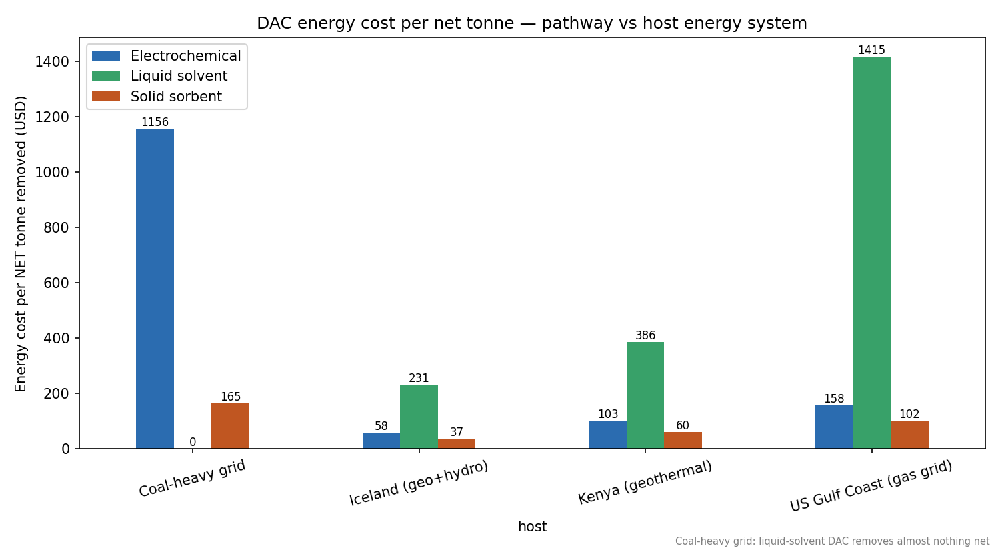
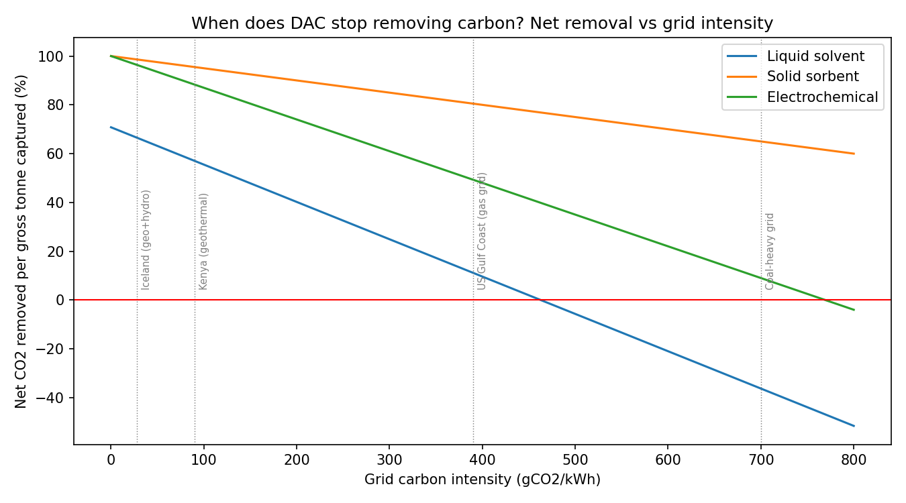

# Direct Air Capture Is an Energy Problem — Where You Build Decides Everything

Every tonne of CO₂ captured from air needs **1,200–2,500 kWh of energy**. That
single fact turns DAC siting into an energy-systems decision: the host grid's
carbon intensity and power/heat prices decide the cost per **net** tonne removed —
and on dirty grids, whether the plant removes carbon at all.

This repo models three DAC pathways across four host energy systems and answers
the commercial question: **what does a net tonne actually cost, and where should
you build?**

## Headline results (energy cost per net tonne removed)

| Pathway | Kenya (geothermal) | Iceland | US Gulf Coast | Coal-heavy grid |
|---|---|---|---|---|
| **Solid sorbent** (Climeworks-type) | **$60** | $37 | $102 | $165 |
| Electrochemical (pilot) | $103 | $58 | $158 | $1,156 |
| Liquid solvent (CE-type) | $386 | $231 | $1,415 | **net-negative** |

*Energy cost only — excludes CAPEX, labour, storage/MRV. Net removal fraction on
a coal grid: liquid solvent −0.57 (it emits more than it captures).*




## Three findings

1. **Pathway and grid must be matched.** Solid-sorbent DAC needs mostly *low-grade
   heat* (~100 °C), which geothermal brine supplies almost free — that is why
   Climeworks built in Iceland, and why **Kenya's Rift Valley is one of the best
   DAC sites on Earth** (clean ~90 gCO₂/kWh grid + geothermal heat + steam-field
   infrastructure already in place). Kenyan developers (Octavia Carbon, the
   "Great Carbon Valley" thesis) are building exactly this case.
2. **Liquid-solvent DAC lives or dies on its 900 °C heat source.** On gas heat its
   net removal fraction collapses (0.11 on a US gas grid); it only makes sense with
   dedicated clean heat — which competes with every other industrial use of that energy.
3. **DAC competes for clean power.** At ~550 kWh-el/t, a 1 Mt/yr solid-sorbent
   plant needs ~500 GWh/yr — about 5% of Kenya's current generation. The real
   constraint on scaling is not sorbent chemistry, it is the pipeline of cheap
   low-carbon energy — the same pipeline grids, green hydrogen and industry want.

## Run it

```bash
pip install -r requirements.txt
python dac_decision_model.py
```

Outputs (`outputs/`): pathway × host matrix (CSV), cost-per-net-tonne chart,
net-removal-vs-grid-intensity curve, and a Kenya learning-curve projection.

`Direct Air Capture (DAC) methods.ipynb` — original exploratory notebook, kept
for reference.

## Assumptions and sources

Pathway energy demands anchored to public literature (Carbon Engineering/1PointFive
disclosures, Climeworks Orca/Mammoth reporting, NASEM negative-emissions study);
host-system prices and grid intensities are representative point estimates
(Ember/IEA grid data, national utility tariffs). All values sit inside wide
published ranges — the point of the model is the *structure* of the decision,
and the ranking is robust to the uncertainty.
